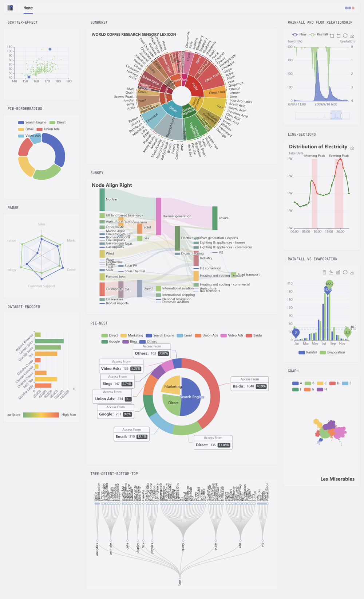

## Features

This widget allows you to integrate charts and graphs created by the Apache ECharts library into your Glance dashboard.

<details>
<summary><strong>Preview</strong></summary>
<br>



</details>

## Configuration

Configuration is done through YAML files.

```yaml
- type: echarts
  title: radar
  height: 300px
  data: >
    {"legend":{"data":["Budget","Spending"]},"radar":{"indicator":[{"name":"Sales","max":6500},{"name":"Administration","max":16000},{"name":"Information Technology","max":30000},{"name":"Customer Support","max":38000},{"name":"Development","max":52000},{"name":"Marketing","max":25000}]},"series":[{"name":"Budget vs spending","type":"radar","data":[{"value":[4200,3000,20000,35000,50000,18000],"name":"Allocated Budget"},{"value":[5000,14000,28000,26000,42000,21000],"name":"Actual Spending"}]}]}
```

or

```yaml
- type: echarts
  title: radar
  height: 300px
  data-url: http://ENDPOINT_WHERE_HOSTING_THE_JSON_FILE

```

Try the example [`glance-echarts.yml`](https://github.com/osnsyc/glance-echarts/blob/main/docs/glance-echarts.yml)

## Installation

<summary><strong>Manual binary installation</strong></summary>
<br>

Precompiled binaries are available for Linux, Windows and macOS (x86, x86_64, ARM and ARM64 architectures).

Visit the [latest release page](https://github.com/osnsyc/glance-echarts/releases/latest) for available binaries.